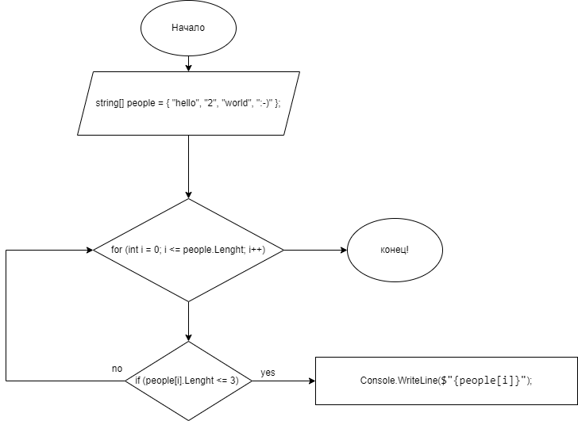

# Итоговая проверочная работа.

Данная работа необходима для проверки ваших знаний и навыков по итогу прохождения первого блока обучения
на программе разработчик. Мы должны убедиться что базовое знакомство с it прошло успешно.

Задача алгоритмически не самая сложная, однако для полценного выполнения проверочной работы необходимо:

1. Создать репозиторий на GitHub

2. Нарисовать блок-схему алгоритма (можно обойтись блок-схемой основной содержательной части, если вы
   выделяете её в отдельный метод)

3. Снабдить репозиторий оформленным текстовым описанием решения (файл README.md)

4. Написать программу, решающую поставленную задачу

5. Использовать контроль версий в работе над этим небольшим проектом (не должно быть так что все залито
   одним коммитом, как минимум этапы 2, 3 и 4 должны быть расположены в разных коммитах)

Задача: Написать программу, которая из имеющегося массива строк формирует массив из строк, длина которых
меньше либо равна 3 символа. Первоначальный массив можно ввести с клавиатуры, либо задать на старте
выполнения алгоритма. При решении но рекомендуется пользоваться коллекциями, лучше обойтись
исключительно массивами.

### Примеры:

* ["hello", "2", "world", ":-)"] -> ["2", ":-)"]
* ["1234", "1567", "-2", "computer science"] -> ["-2"]
* ["Russia", "Denmark", "Kazan"] -> []

## 1. Создать репозиторий на github
* [репозиторий](https://github.com/Vilina-G/test_DZ)
## 2. Нарисовать блок-схему алгоритма (можно обойтись блок-схемой основной содержательной части, если вы выделяете её в отдельный метод)

## 3. Снабдить репозиторий оформленным текстовым описанием решения (файл README.md)

* Программа состоит из трёх методов и 2 переменных:
  * Методы
    * EnterArray - выводит начальный массив в консоль.
    * FilterArray - выводит массив который содержит три или меньше символа.
  * Переменные
    * people - начальный массив
## 4. Написать программу, решающую поставленную задачу
* [программа](https://github.com/Vilina-G/test_DZ/blob/main/Program.cs)

## 5. Использовать контроль версий в работе над этим небольшим проектом (не должно быть так что все залито одним коммитом, как минимум этапы 2, 3 и 4 должны быть расположены в разных коммитах)

